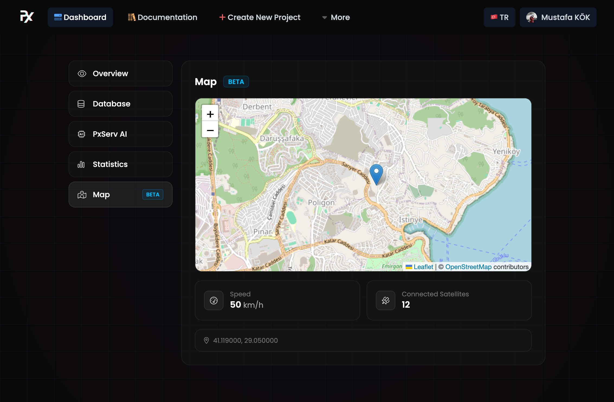

# Map Feature

* Purpose: show device locations and basic telemetry (speed, connected satellites).
* Location: Map panel in the project dashboard.

## Required data keys

The Map panel reads the latest value for each of these keys from the project database:

* `map/lat` — latitude (decimal degrees)
* `map/long` — longitude (decimal degrees)
* `map/speed` — speed in km/h (optional)
* `map/connectedsats` — number of connected satellites (optional)

Note: all values must be sent and stored as strings (for example: `"40.712776"`). The UI queries these keys and shows a warning if required keys are missing.

## UI design

<figure><figcaption></figcaption></figure>

## Example publishes

Values must be strings. Example payloads:

* HTTP REST API (single key):

```bash
curl -s -X POST https://api.pxserv.net/database/setData \
  -H "Content-Type: application/json" -H "apikey: YOUR_KEY" \
  -d '{"key":"map/lat","value":"40.712776"}'
```

Details: See the REST API Data Saving page for full HTTP API details: [Data Saving](rest-api/database/data-saving.md)

## Short examples (official libraries)

* Arduino (PxServ library):

```cpp
PxServ client("YOUR_API_KEY");
client.setData("map/lat", "40.712776");
```

Details: See the Arduino Library for usage and configuration: [Arduino Library](arduino-library.md)

* JavaScript / TypeScript (pxserv):

```typescript
await pxServ.setData("map/long", "-74.005974");
```

Details: See the JavaScript / TypeScript Library for examples and SDK details: [JavaScript / TypeScript Library](javascript-typescript-library.md)

* Rust (`pxserv` crate):

```rust
let resp = client.setdata("map/speed", "12.5");
```

Details: See the Rust Library for crate usage: [Rust Library](rust-library.md)

## Tips

* Choose an appropriate update frequency for moving devices (for example, 5–30 s).
* Reduce jitter by filtering or averaging noisy GPS data.
* If privacy is a concern, reduce precision or send updates less frequently when the device is stationary.

## Troubleshooting

* If the interface shows "Waiting for coordinates...", verify that `map/lat` and `map/long` are being sent to and stored in the database.
* If a yellow warning appears, ensure the required keys have been published at least once.
