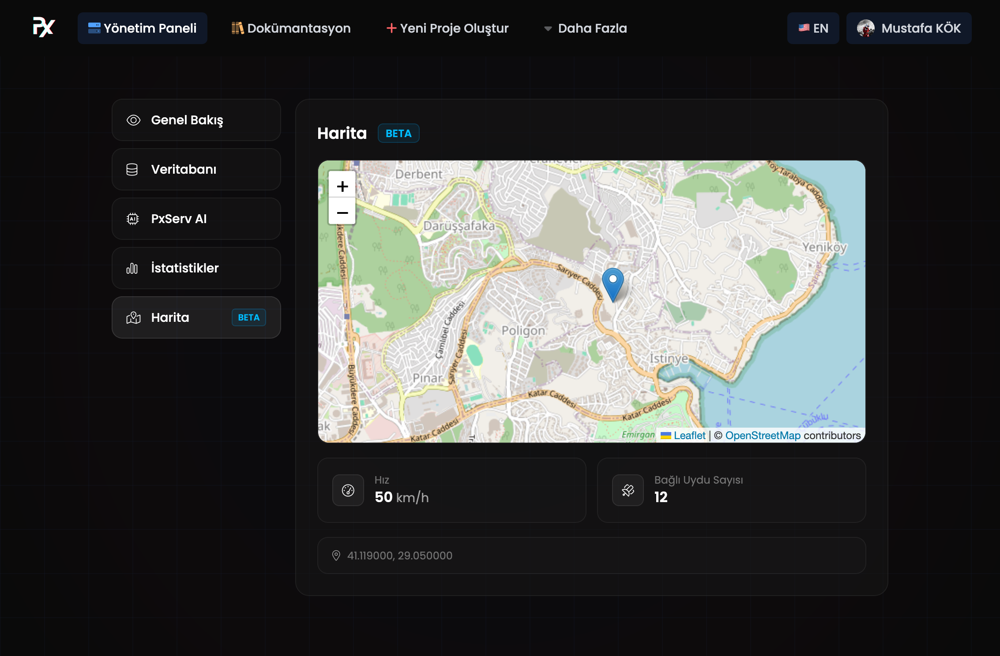

# Harita Özelliği

* Amaç: Cihaz konumlarını ve temel telemetriyi (hız, bağlı uydu sayısı) görselleştirmek.
* Göründüğü yer: Kontrol panelindeki Harita bölümü.

## Gereken veri anahtarları

Harita paneli aşağıdaki anahtarları bekler:

* `map/lat` — enlem (ondalık derece)
* `map/long` — boylam (ondalık derece)
* `map/speed` — hız (km/s, opsiyonel)
* `map/connectedsats` — bağlı uydu sayısı (opsiyonel)

Not: Tüm değerler metin (string) olarak gönderilmelidir. Örneğin `"40.712776"` kullanın; ham sayısal tip göndermeyin. Arayüz bu anahtarları veritabanında arar; eksikse uyarı görüntüler.

## Arayüz tasarımı

<figure><figcaption></figcaption></figure>

## Örnek gönderimler

Değerler string olarak gönderilmelidir. Örnekler:

* Düz konu/değer (ör. MQTT):

```json
map/lat: "40.712776"
map/long: "-74.005974"
map/speed: "12.5"
map/connectedsats: "7"
```

* HTTP REST API (tek anahtar):

```bash
curl -s -X POST https://api.pxserv.net/database/setData \
  -H "Content-Type: application/json" -H "apikey: YOUR_KEY" \
  -d '{"key":"map/lat","value":"40.712776"}'
```

Detaylar: HTTP API ayrıntıları için bkz: [Veri Kaydetme](rest-api/veritabani/veri-kaydetme.md)

## Kısa örnekler (resmi kütüphaneler)

* Arduino (PxServ kütüphanesi):

```cpp
PxServ client("YOUR_API_KEY");
client.setData("map/lat", "40.712776");
```

Detaylar: Kullanım ve yapılandırma için bkz: [Arduino Kütüphanesi](arduino-kutuphanesi.md)

* JavaScript / TypeScript (pxserv):

```typescript
await pxServ.setData("map/long", "-74.005974");
```

Detaylar: Örnekler ve SDK bilgileri için bkz: [JavaScript / TypeScript Kütüphanesi](javascript-typescript-kutuphanesi.md)

* Rust (`pxserv` crate):

```rust
let resp = client.setdata("map/speed", "12.5");
```

Detaylar: Crate kullanımı için bkz: [Rust Kütüphanesi](rust-kutuphanesi.md)

## İpuçları

* Hareketli cihazlar için uygun güncelleme sıklığını seçin (örn. 5–30 s).
* Gürültüyü azaltmak için konum verilerini filtreleyin veya ortalama alın.
* Gizlilik gerekiyorsa hassasiyeti düşürün veya sabitken güncellemeyi seyrekleştirin.

## Sorun giderme

* Ekranda "Koordinat bekleniyor..." görünüyorsa `map/lat` ve `map/long` veritabanına gönderiliyor mu kontrol edin.
* Sarı uyarı çıkıyorsa gerekli anahtarlar en az bir kez yayınlanmış olmalıdır.
